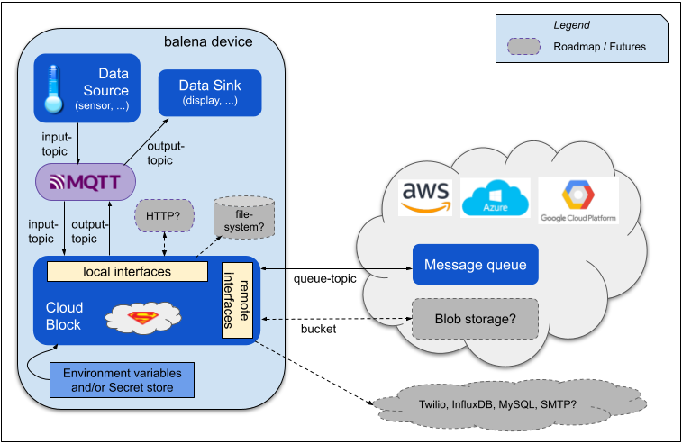

# Architecture

The diagram below shows the components of a solution based on the cloud block. The data source, MQTT, and cloud block run on your balena device.

|  Component   | Description                                                                                  |
|--------------|----------------------------------------------------------------------------------------------|
| Data Source  | Your application container, which generates data formatted into MQTT messages                |
| MQTT         | Message broker to transfer messages to the cloud block                                       |
| Cloud Block  | Container to package and route new data messages to a cloud service, based on configuration you provide.|
| Cloud Service| A supported service at a cloud provider to receive the data. See the list of supported services in the section below on plugins.                                  |
