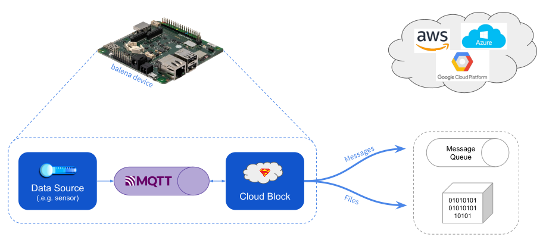

# balenaBlocks/cloud #
The cloud block provides a low-friction push of application data to cloud providers including Microsoft Azure, Amazon AWS and Google Cloud Platform. The `cloud` block itself is a docker image based on the [dapr.io](https://dapr.io/) utility.


## Architecture

The diagram below shows the components of a solution based on the cloud block. The data source, MQTT, and cloud block run on your balena device.



|  Component   | Description                                                                                  |
|--------------|----------------------------------------------------------------------------------------------|
| Data Source  | Your application container, which generates data formatted into MQTT messages                |
| MQTT         | Message broker to transfer messages to the cloud block                                       |
| Cloud Block  | Container to package and route new data messages to a cloud service, based on configuration you provide.|
| Cloud Service| A supported service at a cloud provider to receive the data. See the list of supported services in the section below on plugins.                                  |


### Cloud Service Support

Presently the cloud block supports these services.

| Type              | Services      |
|-------------------|---------------|
| Message Queue     | AWS SQS, Azure Event Hubs, GCP Pub/Sub |
| Object Storage    | AWS S3, Azure Blob Storage, GCP Cloud Storage |

To use a cloud service you only need to specify the actual variables  required by the service, like a connection string or a client ID. Define all of the required variables, and your data automatically is pushed to the service. See the *Environment Variables* section below for details. You also may push data to more than one cloud service at a time.

Internally the cloud block uses a flexible plugin capability to match these variables to the specific cloud service requirements, as defined by the dapr utility.

## Usage

### docker-compose file

You need three services in your Docker compose file: the cloud block, MQTT, and your data source.

```
version: '2.1'

services:
    cloud:
        image: balenablocks/cloud
        restart: always
    mqtt:
        # pinned to this release and NUC arch
        image: eclipse-mosquitto@sha256:52d0254fc54bea116ceb5fc066331ba82ed2ae4b66e2cc238a90f708439b32d7
        ports:
            - "1883:1883"
        restart: always
    # example data source; name it as you see fit
    dataSource:
        build: dataSource
        restart: always
        network_mode: host
        privileged: true
        depends_on:
            - "cloud"
            - "mqtt"
```

### Cloud block

You must configure the cloud block with the credentials and identifiers required to use each service, like a connection string or project ID. There are two ways to provide this configuration data:

   * Balena environment variables for each configuration element
   * Secret store in the cloud that contains each element

See the subsections below for each approach.

#### Environment variables

With this approach you define an balena environment variable for each element of the service configuration. See this links below for details on each service.

   * AWS SQS
   * AWS S3
   * Azure Blob Storage
   * Azure Event Hubs
   * GCP Cloud Storage
   * [GCP Pub/Sub](doc/GcpPubsubOutputVars.md)

For example to configure GCP Pub/Sub, define balena environment variables GCP_PUBSUB_TOPIC, GCP_PUBSUB_TYPE, etc. with the appropriate values.

#### Secret store

Since the configuration data is for cloud services, you may find it more convenient to store the service configuration in the cloud also. Cloud providers have developed secret stores, like Azure Key Vault, that you may use to store the service configuration.

In this case you still must define some balena environment variables to access the cloud secret store itself. The cloud block then will read the required configuration elements for each cloud service from the secret store.

See the list of services above in the Environment variables section for the required key name and content of each configuration element in the secret store. Also see the list of secret stores below for the balena environment variables you must define to access the store.

Supported secret stores:

   * [Azure Key Vault](doc/AzureKeyVaultVars.md)

For example to configure Azure Event Hubs, add secrets named *azure-eh-connectionstring*, *azure-eh-consumer-group*, etc. to the Azure Key Vault. Then define balena environment variables AZURE_VAULT_NAME, AZURE_VAULT_TENANT_ID, and AZURE_VAULT_CLIENT_ID for the key vault secret store.

Notice that the formatting for a secret key name is a simple transformation of the corresponding environment variable name:

   * Upper case to lower case
   * Underscore ("_") to dash ("-")

So for example the secret store variable name *azure-eh-connectionstring* corresponds to the environment variable name *AZURE_EH_CONNECTIONSTRING*.


## Supported Devices

The `cloud` block has been tested with these devices:

| Device Type  | Status |
| ------------- | ------------- |
| Intel NUC | ✔ |


## Data Source

The nature of the data source container is specific to your application and how its generates data. The cloud block only requires that you publish the application data to the `cloud-input` topic for the MQTT broker on the device. See a simple example below.

```python
client = mqtt.Client()
while True:
    client.connect("localhost", 1883, 60)

    value = getReading() # code omitted for brevity
    msgInfo = client.publish('cloud-input', str(value), 0, False)
    if False == msgInfo.is_published():
        msgInfo.wait_for_publish()

    client.disconnect()
    time.sleep(30)
```
