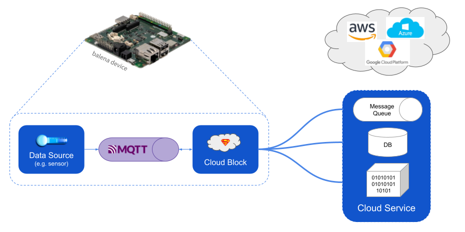

# balenaBlocks/cloud #
A balenaBlock to provide low-friction push of application data to cloud providers including Microsoft Azure, Amazon AWS and Google Cloud Platform. Also accepts data pushed *from* the cloud provider. The `cloud` block itself is a docker image based on the [dapr.io](https://dapr.io/) utility.


## Architecture

The diagram below shows the components of a solution based on the cloud block. The data source, MQTT, and cloud block run on your balena device.



|  Component   | Description                                                                                  |
|--------------|----------------------------------------------------------------------------------------------|
| Data Source  | Your application container, which generates data formatted into MQTT messages                |
| MQTT         | Message broker to transfer messages to the cloud block                                       |
| Cloud Block  | Container to package and route new data messages to a cloud service, based on configuration you provide.|
| Cloud Service| A supported service at a cloud provider to receive the data. See the list of supported services in the section below on plugins.                                  |


### Cloud Service Plugins

The cloud block uses a flexible plugin capability to allow you to specify the service you wish to receive application data. Presently the cloud block supports the services below.

| Type              | Services      |
|-------------------|---------------|
| Message Queue     | AWS SQS, Azure Event Hubs, GCP Pub/Sub |
| Object Storage    | AWS S3, Azure Blob Storage, GCP Cloud Storage |

## Configuration

### docker-compose file

You need three services in your Docker compose file: the cloud block, MQTT, and your data source.

```
version: '2.1'

services:
    cloud:
        image: balenablocks/cloud
        restart: always
    mqtt:
        # pinned to this release and NUC arch
        image: eclipse-mosquitto@sha256:52d0254fc54bea116ceb5fc066331ba82ed2ae4b66e2cc238a90f708439b32d7
        ports:
            - "1883:1883"
        restart: always
    # placeholder for your data source
    dataSource:
        build: dataSource
        restart: always
        network_mode: host
        privileged: true
        depends_on:
            - "cloud"
            - "mqtt"
```

### Cloud service

Each cloud service requires you to define environment variables to configure the service. The list below provides links that list the specific variables.

* AWS SQS
* AWS S3
* Azure Blob Storage
* Azure Event Hubs
* GCP Cloud Storage
* [GCP Pub/Sub](doc/GcpPubsubOutputVars.md)


*??? Mention alternative configuration via dapr native YAML file?*

## Supported Devices

The `cloud` block has been tested with these devices:

| Device Type  | Status |
| ------------- | ------------- |
| Intel NUC | ✔ |

